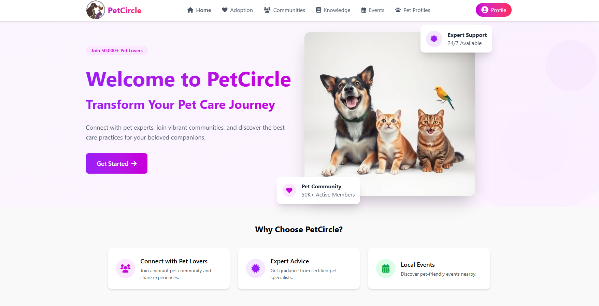
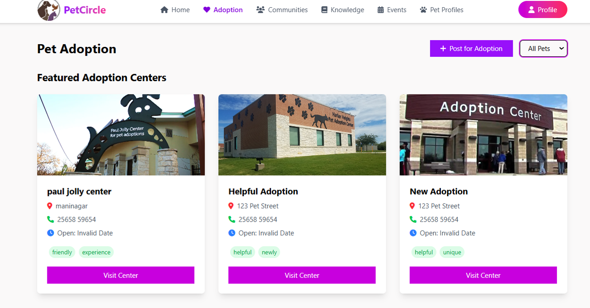
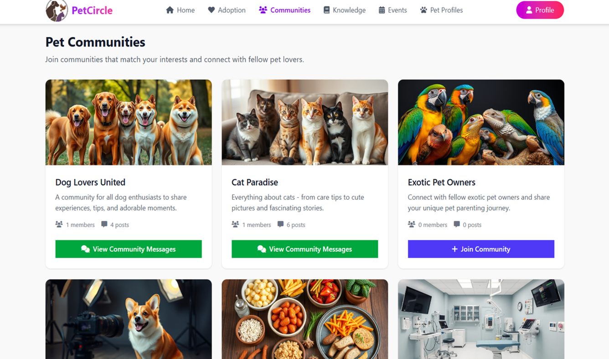
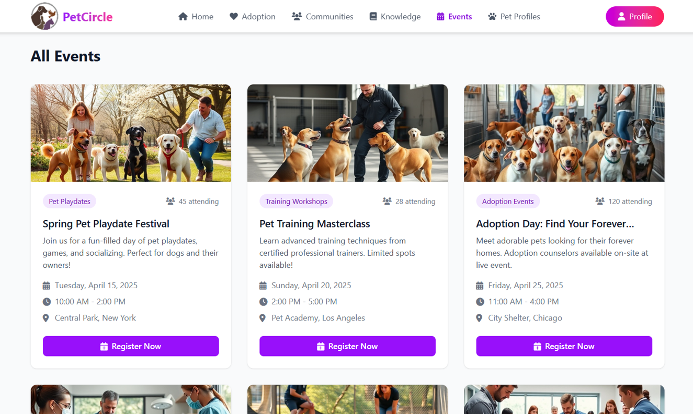
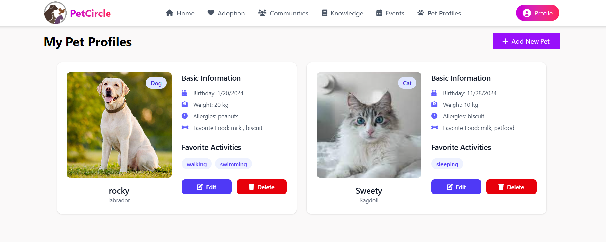

# 🐾 PetCircle

**PetCircle** is a full-featured pet-focused social media platform built using the **MERN stack (MongoDB, Express.js, React.js, Node.js)**. It connects pet owners, adopters, and pet experts in a vibrant, interactive, and supportive community.

## 🌐 Live Demo
> _Coming Soon!_

---

## 📌 Features

### 🔐 User Authentication
- Secure login and signup with JWT and OAuth
- Role-based access for Pet Owners, Experts, and Admins

### 🐶 Pet Profiles
- Add, edit, and view detailed pet profiles
- Upload photos, health records, and milestones

### 📢 Community Feed
- Share posts, ask questions, and engage with others
- Join interest-based pet communities by breed/type/location

### 💬 Real-time Messaging
- Private 1-on-1 chat and group chat using WebSocket/Firebase
- Notifications and user presence indicators

### 🩺 Knowledge Center (Expert Module)
- Experts can publish pet care articles and tips
- Host live sessions, Q&As, and webinars

### 🏠 Adoption Center
- Browse and post pet adoption or rehoming listings
- Filter by location, breed, or type of pet

### 📆 Events & Meetups
- Create and join pet meetups, training sessions, and adoption drives

### 🛠️ Admin Dashboard
- Manage users, content moderation, and platform analytics

---

## 🛠️ Tech Stack

| Area              | Tech Used                            |
|-------------------|--------------------------------------|
| Frontend          | React.js, Tailwind CSS, ShadCN UI    |
| Backend           | Node.js, Express.js                  |
| Database          | MongoDB, Mongoose                    |
| Authentication    | JWT, OAuth 2.0, bcrypt.js            |
| Real-time Chat    | WebSockets                           |
| Deployment        | Vercel (Frontend), AWS/DigitalOcean (Backend) |
| Tools & Others    | Git, GitHub, Postman, Figma          |

---

## 📅 Project Timeline

| Weeks | Tasks |
|-------|-------|
| 1–2 | Requirement Gathering & UI Planning |
| 3–4 | MongoDB Schema & Backend Setup |
| 5–6 | Auth System & Role-Based Access |
| 7–8 | Frontend Components (React + Tailwind) |
| 9–10 | Messaging, Posting, Adoption Features |
| 11–12 | Testing & Debugging |
| 13–14 | Final Deployment & Documentation |

---

## 📷 Screenshots

### 🔹 Home

### 🔹 Adoption

### 🔹 Communities

### 🔹 Knowledge Center

### 🔹 Events

### 🔹 PetProfile

---

## 📄 License

This project is open-source under the [MIT License](LICENSE).

---

## 👨‍💻 Developed By

**[Urvish Moradiya]**  
_Intern Developer | MERN Stack Enthusiast_
